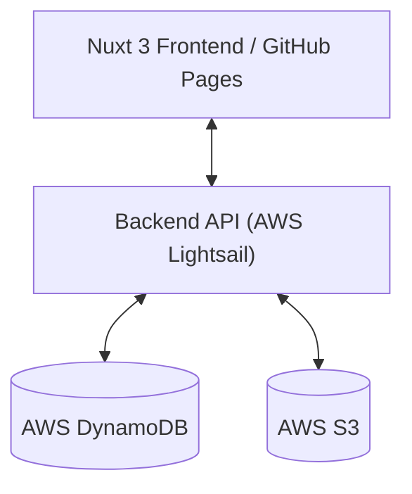

# AI 가상 피팅 어드민 대시보드 (AI Fitting Admin Dashboard)

본 프로젝트는 AI 가상 피팅 서비스의 운영 및 관리를 위한 관리자 전용 웹 대시보드입니다. API 키 관리, 작업 상태 모니터링 및 통계 확인 기능을 제공합니다.

---

## 🚀 프로젝트 개요 및 요약

이 서비스는 파트너사별 API 사용 권한을 제어하고, 대량으로 생성되는 AI 가상 피팅 작업의 상태를 실시간으로 확인하며 결과물을 시각적으로 검토하는 것을 목적으로 합니다. 모던한 다크 모드 기반의 **Glassmorphism** 디자인을 적용하여 프리미엄한 관리 환경을 제공합니다. 현재 **GitHub Pages**를 통해 호스팅되며, **AWS Lightsail**에서 구동되는 백엔드 API와 연동됩니다.

---

## ✨ 주요 기능

### 1. 대시보드 (Dashboard)
- **실시간 통계**: 총 작업 수, 상태별 통계 등 운영 지표를 시각화하여 확인합니다.
- **최근 작업 현황**: 최신 5건의 작업 및 실패 내역을 대시보드 메인에서 즉시 검토합니다.

### 2. API 키 관리 (API Key Management)
- **키 생성 및 관리**: 보안된 API 키를 생성하고 파트너별 할당 기능을 제공합니다.
- **상세 제어**: 생성일/만료일 지정, 활성/비활성 상태 전환 및 소유자 정보 수정이 가능합니다.

### 3. 작업 목록 및 검토 (Jobs & Previews)
- **다단 뷰 모드**: 효율적인 관리를 위한 **목록형(List)**과 시각적 검토를 위한 **그리드형(Grid)** 모드를 지원합니다.
- **상태 유지(Persistence)**: 페이지 이동 시에도 필터링 및 보기 모드 설정이 유지됩니다.

---

## 🏗 아키텍처 및 데이터 흐름



- **Frontend**: Nuxt 3 (SPA Mode)
- **Backend Service**: [AI 가상 피팅 API 서버](../ai-fitting-api-admin) (`https://ai-fitting-api-admin.duckdns.org`)
- **Hosting**: GitHub Pages

---

## 🔐 환경변수 (Environment Variables)

로컬 실행 또는 빌드 시 `.env` 파일에 다음 변수를 설정합니다.

| 변수명 | 설명 | 비고 |
| :--- | :--- | :--- |
| `NUXT_PUBLIC_API_BASE` | 백엔드 API 서버의 기본 URL | (예: `https://ai-fitting-api-admin.duckdns.org`) |

---

## 🛠 개발 및 빌드

### 요구 사항
- Node.js 18.x 이상
- npm

### 의존성 설치
```bash
npm install
```

### 로컬 개발 서버 실행
```bash
npm run dev
```
- 기본 접속 주소: `http://localhost:3000`

### 정적 사이트 생성 (GitHub Pages 배포용)
```bash
# 정적 파일 생성
npm run generate
```

---

> [!NOTE]
> 본 프론트엔드 대시보드는 백엔드 API 서버가 정상적으로 구동 중이어야 모든 데이터를 확인할 수 있습니다.
