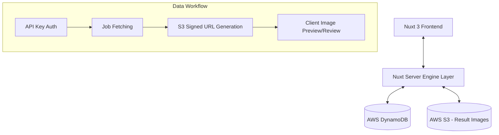

# AI 가상 피팅 어드민 대시보드 (AI Fitting Admin Dashboard)

본 프로젝트는 AI 가상 피팅 서비스의 운영 및 관리를 위한 관리자 전용 웹 대시보드입니다. API 키 관리, 작업 상태 모니터링 및 결과 이미지 검토 기능을 제공합니다.

---

## 🚀 프로젝트 개요 및 요약

이 서비스는 파트너사별 API 사용 권한을 제어하고, 대량으로 생성되는 AI 가상 피팅 작업의 상태를 실시간으로 확인하며 결과물을 시각적으로 검토하는 것을 목적으로 합니다. 모던한 다크 모드 기반의 **Glassmorphism** 디자인을 적용하여 프리미엄한 관리 환경을 제공합니다.

---

## ✨ 주요 기능

### 1. 대시보드 (Dashboard)
- **실시간 통계**: 총 작업 수, 활성 API 키 수 등 운영 지표를 카드 형태로 제공합니다.
- **최근 작업 현황**: 대시보드 메인에서 최신 작업 내역을 요약하여 보여줍니다.

### 2. API 키 관리 (API Key Management)
- **키 생성 및 관리**: UUID 형식의 안전한 API 키 생성 및 파트너별 할당 기능을 제공합니다.
- **보안 강화**: API 키 마스킹 처리 및 클릭 시에만 노출되는 보안 토글 기능을 포함합니다.
- **상세 제어**: 생성일/만료일 지정, 활성/비활성 상태 전환 및 소유자 정보 수정이 가능합니다.

### 3. 작업 목록 및 검토 (Jobs & Previews)
- **다단 뷰 모드**: 전통적인 **목록형(List)**과 이미지 위주의 **썸네일형(Grid)** 보기 모드를 지원합니다.
- **이미지 미리보기**: 별도의 페이지 이동 없이 목록에서 즉시 이미지를 확인할 수 있는 플로팅 프리뷰 기능을 제공합니다.
- **상세 데이터**: 각 작업의 요청 ID, 파트너 정보, 요청 시간 및 상세 메타데이터를 제공합니다.

### 4. 사용자 경험 (UX)
- **상태 유지(Persistence)**: 페이지 이동 시에도 선택한 필터, 보기 모드, 페이지 번호가 그대로 유지됩니다.
- **반응형 최적화**: FHD 해상도에 최적화된 레이아웃을 제공하여 데이터 집약적인 화면에서도 높은 가독성을 보장합니다.

---

## 🏗 아키텍처 및 데이터 흐름



- **Frontend**: Nuxt 3 (Vue 3, Composition API)를 활용한 SSR/CSR 하이브리드 어플리케이션.
- **Backend API**: Nuxt Server Routes를 사용하여 AWS SDK와 직접 통신.
- **Database**: 스케일링과 고성능 조회를 위해 AWS DynamoDB 사용.
- **Storage**: 결과 이미지는 S3에 보안 저장되며, 어드민 조회 시에만 **Pre-signed URL**을 통해 실시간 접근 권한을 부여합니다.

---

## � 디렉토리 구조 (Source Structure)

```text
ai-fitting-admin/
├── assets/             # 정적 리소스 및 전역 스타일 (CSS 등)
│   └── css/main.css    # 전역 디자인 시스템 및 테마 변수
├── components/         # 재사용 가능한 UI 컴포넌트
│   └── ui/             # 공통 UI 요소 (Button, Table, Card, Badge 등)
├── composables/        # 공통 상태 관리 및 비즈니스 로직
│   ├── useJobsState.ts # 작업 목록 필터 및 상태 유지
│   └── useTheme.ts     # 다크/라이트 모드 테마 전환
├── layouts/            # 페이지 레이아웃 (사이드바, 헤더 포함)
├── pages/              # 앱 페이지 (라우팅 경로)
│   ├── index.vue       # 대시보드 메인
│   ├── api-keys/       # API 키 관리 화면
│   ├── jobs/           # 가상 피팅 작업 목록 및 상세
│   └── images/         # 결과 이미지 상세 리뷰
├── server/             # Nitro 서버 엔진 (Backend API)
│   ├── api/            # API 엔드포인트 정의 (AWS SDK 연동)
│   └── utils/          # 서버 측 유틸리티 (AWS 연결 설정 등)
├── public/             # 일반 정적 파일
├── nuxt.config.ts      # Nuxt 프로젝트 설정
└── README.md           # 프로젝트 문서
```

---

## �🔐 환경변수 (Environment Variables)

프로젝트 실행을 위해 루트 디렉토리에 `.env` 파일을 생성하고 다음 변수들을 설정해야 합니다.

| 변수명 | 설명 | 비고 |
| :--- | :--- | :--- |
| `AWS_REGION` | AWS 서비스가 동작하는 지역 | (예: `ap-northeast-2`) |
| `AWS_ACCESS_KEY_ID` | AWS IAM 액세스 키 ID | **[보안 주의]** |
| `AWS_SECRET_ACCESS_KEY` | AWS IAM 시크릿 액세스 키 | **[보안 주의]** |
| `DYNAMODB_TABLE_JOBS` | 피팅 작업 데이터가 저장된 테이블 명 | |
| `DYNAMODB_TABLE_API_KEYS` | API 키 관리 데이터가 저장된 테이블 명 | |
| `S3_BUCKET_NAME` | 결과 이미지가 저장된 S3 버킷 명 | |

---

## 🛠 개발 및 빌드

### 요구 사항
- Node.js 18.x 이상
- npm 또는 yarn

### 의존성 설치
```bash
npm install
```

### 로컬 개발 서버 실행
```bash
npm run dev
```
- 기본 접속 주소: `http://localhost:3000`

### 프로덕션 빌드 및 실행
```bash
# 빌드 실행
npm run build

# 빌드된 결과물 실행 (Node.js 환경)
node .output/server/index.mjs
```

---

> [!IMPORTANT]
> 본 저장소에는 중요 자격 증명(`.env`)이 포함되어 있지 않습니다. 반드시 사전에 환경변수를 설정하시기 바랍니다.
